# Africa 

## Records

## Subordinate Collections

| Flag | Region | Flag | Region | Flag | Region |
| :---: | :---: | :---: | :---: | :---: | :---: |
| 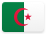 | Algeria |  | Angola |  | Benin |
|  | Botswana |  | Burkina Faso |  | Burundi |
|  | Cameroon |  | Cape Verde | 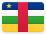 | Central African Republic |
|  | Chad |  | Comoros |  | Congo (Republic of the) |
|  | Congo (Democratic Republic of the) |  | Côte d'Ivoire | 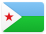 | Djibouti |
|  | Egypt |  | Equatorial Guinea |  | Eritrea |
|  | Ethiopia |  | French Southern and Antarctic Territories | 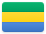 | Gabon |
|  | Gambia (the) |  | Ghana |  | Guinea |
| 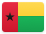 | Guinea-Bissau |  | Kenya |  | Lesotho |
|  | Liberia |  | Libya |  | Madagascar |
|  | Malawi |  | Maldives | 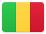 | Mali |
|  | Mauritania |  | Mauritius |  | Mayotte |
|  | Morocco | 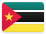 | Mozambique | 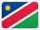 | Namibia |
|  | Niger (the) |  | Nigeria | 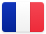 | Réunion |
| 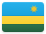 | Rwanda |  | São Tomé and Príncipe | 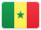 | Senegal |
|  | Seychelles |  | Sierra Leone |  | Somalia |
|  | South Africa |  | South Sudan |  | Sudan |
|  | Swaziland |  | Togo |  | Tunisia |
|  | Uganda |  | United Republic of Tanzania (the) |  | Western Sahara |
|  | Zambia |  | Zimbabwe |  |  |