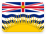
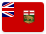
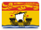
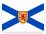
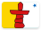
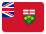
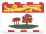
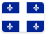
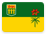
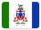

# Canada 

*A mari usque ad mare*, this page contains institutional identity assets and visual history from **Canada** .

## Records

| Image | Identity |
| :---: | :--- |

## Subordinate Collections

| Flag | Region | Flag | Region |
| :---: | :---: | :---: | :---: |
|  | Alberta |  | British Columbia |
|  | Manitoba |  | New Brunswick |
|  | Newfoundland and Labrador |  | Northwest Territories |
|  | Nova Scotia |  | Nunavut |
|  | Ontario |  | Prince Edward Island |
|  | Québec |  | Saskatchewan |
|  | Yukon |

## Navigation

[← Back to North America](../README.md)
