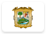
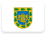
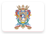
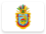
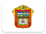
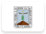
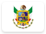
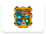
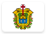
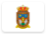

# Mexico 

Institutional identity assets and visual history from the **United Mexican States** .

## Records

| Image | Identity |
| :---: | :--- |

## Subordinate Collections

| Flag | Region | Flag | Region |
| :---: | :---: | :---: | :---: |
|  | Aguascalientes |  | Baja California |
|  | Baja California Sur |  | Campeche |
|  | Chiapas |  | Chihuahua |
|  | Coahuila |  | Colima |
|  | Distrito Federal |  | Durango |
|  | Guanajuato |  | Guerrero |
|  | Hidalgo |  | Jalisco |
|  | México |  | Michoacán |
|  | Morelos |  | Nayarit |
|  | Nuevo León |  | Oaxaca |
|  | Puebla |  | Querétaro |
|  | Quintana Roo |  | San Luis Potosí |
|  | Sinaloa |  | Sonora |
|  | Tabasco |  | Tamaulipas |
|  | Tlaxcala |  | Veracruz |
|  | Yucatán |  | Zacatecas |

## Navigation

[← Back to North America](../README.md)