# North America 

Including Central America and the Caribbean.

## Records

| Image | Identity |
| :---: | :--- |

## Subordinate Collections

| Flag | Region | Flag | Region | Flag | Region |
| :---: | :---: | :---: | :---: | :---: | :---: |
|  | Anguilla |  | Antigua and Barbuda |  | Aruba |
|  | Bahamas (the) |  | Barbados |  | Belize |
| 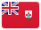 | Bermuda |  | Bonaire, Sint Eustatius, and Saba | 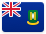 | British Virgin Islands |
|  | Canada | 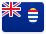 | Cayman Islands |  | Costa Rica |
| 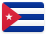 | Cuba |  | Curaçao |  | Dominica |
| 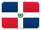 | Dominican Republic | 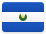 | El Salvador |  | Greenland |
| 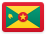 | Grenada |  | Guadeloupe |  | Guatemala |
| 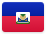 | Haiti |  | Honduras | 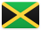 | Jamaica |
| 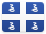 | Martinique | 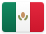 | [Mexico](MX/README.md) |  | Montserrat |
| 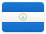 | Nicaragua |  | Panama | 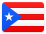 | Puerto Rico |
|  | Saint Barthélemy | 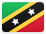 | Saint Kitts and Nevis |  | Saint Lucia |
| 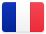 | Saint-Martin |  | Saint-Pierre-et-Miquelon |  | Saint Vincent and the Grenadines |
|  | Sint Maarten |  | Trinidad and Tobago |  | Turks and Caicos Islands |
| 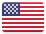 | United States of America |  | United States Virgin Islands |  |  |