# Africa 

## Records

## Subordinate Collections

| Flag | Region | Flag | Region | Flag | Region |
| :---: | :---: | :---: | :---: | :---: | :---: |
| 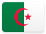 | Algeria | 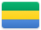 | Gabon | 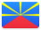 | Réunion |
| 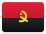 | Angola |  | Gambia (the) | 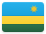 | Rwanda |
| 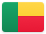 | Benin | 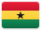 | Ghana | 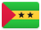 | São Tomé and Príncipe |
|  | Botswana | 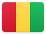 | Guinea | 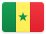 | Senegal |
| 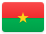 | Burkina Faso | 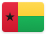 | Guinea-Bissau |  | Seychelles |
| 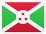 | Burundi | 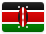 | Kenya |  | Sierra Leone |
|  | Cameroon | 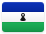 | Lesotho |  | Somalia |
|  | Cape Verde |  | Liberia |  | South Africa |
| 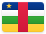 | Central African Republic |  | Libya |  | South Sudan |
|  | Chad |  | Madagascar | 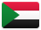 | Sudan |
|  | Comoros |  | Malawi |  | Swaziland |
| 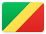 | Congo (Republic of the) | 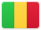 | Mali | 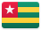 | Togo |
|  | Congo (Democratic Republic of the) |  | Mauritania |  | Tunisia |
| 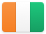 | Côte d'Ivoire |  | Mauritius |  | Uganda |
| 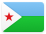 | Djibouti |  | Mayotte |  | United Republic of Tanzania (the) |
|  | Egypt | 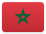 | Morocco | 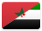 | Western Sahara |
|  | Equatorial Guinea | 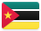 | Mozambique |  | Zambia |
|  | Eritrea | 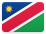 | Namibia |  | Zimbabwe |
|  | Ethiopia | 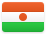 | Niger (the) | | |
|  | French Southern and Antarctic Territories | 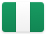 | Nigeria |  |  |