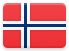
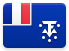
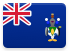

# Antarctica 

Including outlying islands.

## Records

| Image | Identity |
| :---: | :--- |

## Subordinate Collections

| Flag | Region | Flag | Region |
| :---: | :---: | :---: | :---: |
|  | Bouvet Island |  | Heard Island and McDonald Islands |
|  | French Southern and Antarctic Territories |  | South Georgia and South Sandwich Islands |