# Europe 

## Records

| Image | Identity |
| :---: | :------- |

## Collections

| Flag | Region | Flag | Region | Flag | Region |
| :---: | :---: | :---: | :---: | :---: | :---: |
|  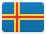 | Åland Islands |  | Gibraltar | 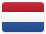 | Netherlands (the) |
|   | Albania |  | Greece |  | Norway |
|   | Andorra |  | Greenland | 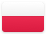 | Poland |
|   | Armenia | 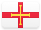 | Guernsey | 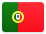 | Portugal |
|  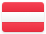 | Austria |  | Holy See (the) |  | Romania |
|   | Azerbaijan |  | Hungary |  | Russian Federation |
|   | Belarus | 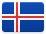 | Iceland |  | San Marino |
|  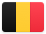 | Belgium |  | Ireland | 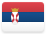 | Serbia |
|   | Bosnia and Herzegovina |  | Isle of Man |  | Slovakia |
|  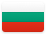 | Bulgaria | 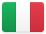 | Italy | 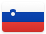 | Slovenia |
|  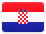 | Croatia |  | Jersey |  | Spain |
|   | Cyprus |  | Kosovo |  | Svalbard and Jan Mayen Islands |
|   | Czechia | 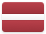 | Latvia | 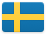 | Sweden |
|  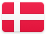 | Denmark |  | Liechtenstein |  | Switzerland |
|   | Estonia |  | Lithuania |  | The former Yugoslav Republic of Macedonia |
|  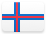 | Faroe Islands |  | Luxembourg |  | Turkey |
|  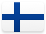 | Finland |  | Malta |  | Ukraine |
|   | France |  | Republic of Moldova (the) |  | United Kingdom of Great Britain and Northern Ireland (the) |
|   | Georgia |  | Monaco |  |  |
|  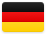 | Germany |  | Montenegro |  |  |