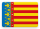

# Spain 

This page contains institutional identity assets and visual history from **Spain** .

## Records

| Image | Identity | Years Active | Tags ([?](/guide/flags.html#Flags-Aiding-in-Classification)) |
| :---: | :------- | :-----------:| :---: |

## Subordinate Collections

Subordinate records for Spain are organized by autonomy.

| Flag | Region | Flag | Region |
| :---: | :---: | :---: | :---: |
|  | [Andalucía](ES/AN.html) |  | [Galicia](ES/GA.html) |
|  | [Aragón](ES/AR.html) |  | [Illes Balears](ES/IB.html) |
|  | [Asturias, Principado de](ES/AS.html) |  | [La Rioja](ES/RI.html) |
|  | [Canarias](ES/CN.html) |  | [Madrid, Comunidad de](ES/MD.html) |
|  | [Cantabria](ES/CB.html) |  | [Melilla](ES/ML.html) |
|  | [Castilla y León](ES/CL.html) |  | [Murcia, Región de](ES/MC.html) |
|  | [Castilla-La Mancha](ES/CM.html) |  | [Navarra, Comunidad Foral de](ES/NC.html) |
|  | [Catalunya](ES/CT.html) |  | [País Vasco](ES/PV.html) |
|  | [Ceuta](ES/CE.html) |  | [Valenciana, Comunidad](ES/VC.html) |
|  | [Extremadura](ES/EX.html) | | | |

## Navigation

[← Back to Europe ](../EU.html)

---

Page instantiated: 22 November 2019.
Date of last revision: 22 November 2019.