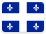

# Canada 

*A mari usque ad mare*, this page contains institutional identity assets and visual history from **Canada** .

## Records

| Image | Identity |
| :---: | :------- |

## Subordinate Collections

| Flag | Region | Flag | Region |
| :---: | :---: | :---: | :---: |
|  | Alberta |  | Nunavut |
|  | British Columbia |  | Ontario |
|  | Manitoba |  | Prince Edward Island |
|  | New Brunswick |  | [Québec](CA/QC.html) |
|  | Newfoundland and Labrador |  | Saskatchewan |
|  | Northwest Territories |  | Yukon |
|  | Nova Scotia | | | |

## Navigation

[← Back to North America ](../NA.html)
