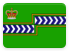
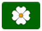
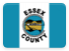
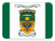

# Ontario 

*Yours to discover,* this page contains institutional identity assets and visual history from the **Province of Ontario** .

## Records

| Image | Identity |
| :---: | :--- |

## Subordinate Collections

Subordinate records from Ontario are organized by administrative division.

In Ontario, one will find **single-tier municipalities**, **regional municipalities**, **counties**, and **districts**, the latter serving no municipal government purpose in and of themselves. For assistance in locating a place of interest, consult the directory of the [Association of Municipalities of Ontario (AMO)](https://www.amo.on.ca/AMO-Content/Municipal-101/Ontario-Municipalities.aspx).

| Flag | Region | Flag | Region |
| :---: | :---: | :---: | :---: |
|   | Algoma District |  | Middlesex County |
|   | Brant County |  | Muskoka (District Municipality of) |
|   | Brantford (City of) |  | Niagara (Regional Municipality of) |
|   | Bruce County |  | Nipissing District |
|   | Chatham-Kent (Municipality of) |  | Norfolk County |
|   | Cochrane District |  | Northumberland County |
|   | Dufferin County |  | Ottawa (City of) |
|   | Durham (Regional Municipality of) |  | Oxford County |
|   | Elgin County |  | Parry Sound District |
|   | Essex County |  | Peel (Regional Municipality of) |
|   | Frontenac County |  | Perth County |
|   | Greater Sudbury (City of) |  | Peterborough County |
|   | Grey County |  | Prescott and Russell (United Counties of) |
|   | Haldimand County |  | Prince Edward County |
|   | Haliburton County |  | Rainy River District |
|   | Halton (Regional Municipality of) |  | Renfrew County |
|   | Hamilton (City of) |  | Simcoe County |
|   | Hastings County |  | Stormont, Dundas and Glengarry (United Counties of) |
|   | Huron County |  | Sudbury District |
|   | Kawartha Lakes (City of) |  | Thunder Bay District |
|   | Kenora District |  | Timiskaming District |
|   | Lambton County |  | Toronto (City of) |
|   | Lanark County |  | Waterloo (Regional Municipality of) |
|   | Leeds and Grenville (United Counties of) |  | Wellington County |
|   | Lennox and Addington County |  | York (Regional Municipality of) |
|   | Manitoulin District |  |  |  |

## Navigation

[← Back to Canada ](../CA.html)