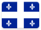

# Québec 

*Ça va?* This page contains institutional identity assets and visual history from the **Province du Québec** .

## Records

| Image | Identity |
| :---: | :--- |

## Subordinate Collections

**Besoin d'aide?**
Records for Québec are organized by administrative region. These units formed the basis of Québec's since-abolished *conférences régionales des élus (CRÉs)*, with two notable exceptions:

>The **Montérégie** region contained the CRÉs of: Longueuil, Montérégie Est (McMasterville), and Vallée-du-Haut-Saint-Laurent (Salaberry-de-Valleyfield).

>The **Nord-du-Québec** region contains governing authorities for: Baie-James (Matagami), the Cree Regional Authority (Nemaska), and the Kativik Regional Government (Kuujjuaq).

While the *gouvernement du Québec* has yet to replace these dissolved regional governments, they are not at this time expected to make substantive changes to the geography of the administrative regions. For assistance in determining which administrative region contains points of interest, feel free to consult [MAMOT's provincal maps](http://www.mamot.gouv.qc.ca/organisation-municipale/cartotheque/cartes-provinciales/).

| Flag | Region | Flag | Region |
| :---: | :---: | :---: | :---: |
|  | Abitibi-Témiscamingue (08) |  | Laurentides (15) |
|  | [Bas-Saint-Laurent (01)](QC/01.html) |  | Laval (13) |
|  | Capitale-Nationale (03) |  | Mauricie (04) |
|  | Centre-du-Québec (17) |  | Montérégie (16) |
|  | Chaudière-Appalaches (12) |  | Montréal (06) |
|  | Côte-Nord (09) |  | Nord-du-Québec (10) |
|  | Estrie (05) |  | Outaouais (07) |
|  | Gaspésie–Îles-de-la-Madeleine (11) |  | Saguenay–Lac-Saint-Jean (02) |
|  | Lanaudière (14) | | | |

## Navigation

[← Back to Canada ](../CA.html)
