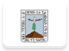
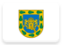
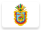
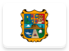
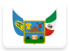
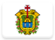
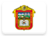

# Mexico 

Institutional identity assets and visual history from the **United Mexican States** .

## Records

| Image | Identity |
| :---: | :--- |

## Subordinate Collections

| Flag | Region | Flag | Region |
| :---: | :---: | :---: | :---: |
|  | Aguascalientes |  | Morelos |
|  | Baja California |  | Nayarit |
|  | Baja California Sur |  | Nuevo León |
|  | Campeche |  | Oaxaca |
|  | Chiapas |  | Puebla |
|  | Chihuahua |  | Querétaro |
|  | Coahuila |  | Quintana Roo |
|  | Colima |  | San Luis Potosí |
|  | Distrito Federal |  | Sinaloa |
|  | Durango |  | Sonora |
|  | Guanajuato |  | Tabasco |
|  | Guerrero |  | Tamaulipas |
|  | Hidalgo |  | Tlaxcala |
|  | Jalisco |  | Veracruz |
|  | México |  | Yucatán |
|  | Michoacán |  | Zacatecas |

## Navigation

[← Back to North America ](../NA.html)