# Oceania 

## Records

| Image | Identity |
| :---: | :------- |

## Subordinate Collections

| Flag | Region | Flag | Region |
| :---: | :---: | :---: | :---: |
|  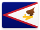 | American Samoa | 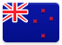 | New Zealand |
|  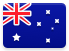 | Australia | 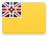 | Niue |
|   | Christmas Island | 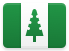 | Norfolk Island |
|   | Cocos (Keeling) Islands |  | Northern Mariana Islands |
|  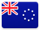 | Cook Islands |  | Palau |
|  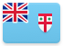 | Fiji | 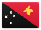 | Papua New Guinea |
|  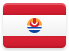 | French Polynesia | 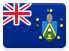 | Pitcairn Islands |
|  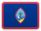 | Guam | 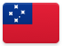 | Samoa |
|   | Heard Island and McDonald Islands | 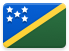 | Solomon Islands |
|  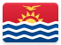 | Kiribati | 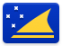 | Tokelau |
|   | Marshall Islands (the) |  | Tonga |
|   | Micronesia (Federated States of) | 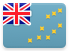 | Tuvalu |
|  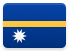 | Nauru | 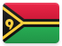 | Vanuatu |
|  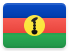 | New Caledonia | 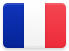 | Wallis and Futuna |