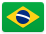

# South America 

## Records

| Image | Identity |
| :---: | :------- |

## Collections

| Flag | Region | Flag | Region |
| :---: | :---: | :---: | :---: |
|  | Argentina |  | French Guiana |
|  | Bolivia (Plurinational State of) |  | Guyana |
|  | Bouvet Island |  | Paraguay |
|  | Brazil |  | Peru |
|  | Chile |  | South Georgia and the South Sandwich Islands |
|  | Colombia |  | Suriname |
|  | Ecuador |  | Uruguay |
|  | Falkland Isalnds (Malvinas) |  | Venezuela (Bolivarian Republic of) |