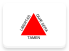

# Brazil 

*Olá velhx amigx, tudo bem?* This page contains institutional identity assets and visual history from **Brazil** .

## Records

| Image | Identity | Years Active | Tags ([?](/guide/flags.html#Flags-Aiding-in-Classification)) |
| :---: | :------- | :-----------:| :---: |
|  | [Pátria Amada](BR/PATRIA.html) | **2019–2022** |   |
|  | [Ordem e Progresso](BR/ORDEM.html) | 2016–2018 |   |
|  | [Pátria Educadora](BR/DILMA2.html) | 2015–2016 |   |
|  | [País Rico é País sem Pobreza](BR/DILMA.html) | 2011–2014 |   |
|  | [Um País de Todos](BR/LULA.html) | 2003–2011 |   |
|  | [8 anos construindo o futuro](BR/8ANOS.html) | 2002 |   |
|  | [Trabalhando em todo o Brasil](BR/FHC99.html) | 1999-2002 |   |
|  | [Brasil em Ação](BR/ACAO.html) | 1997–1998 |   |
|  | [Governo Federal (Early Cardoso)](BR/FHC95.html) | 1995–1996 |   |
|  | [União de Todos](BR/ITAMAR.html) | 1992–1994 |   |
|  | [Governo do Brasil (Collor)](BR/COLLOR.html) | 1990–1992 |   |

## Subordinate Collections

Subordinate records for Brazil are organized by state.

| Flag | Region | Flag | Region |
| :---: | :---: | :---: | :---: |
|  | [Acre](BR/AC.html) |  | [Paraíba](BR/PB.html) |
|  | [Alagoas](BR/AL.html) |  | [Paraná](BR/PR.html) |
|  | [Amapá](BR/AP.html) |  | [Pernambuco](BR/PE.html) |
|  | [Amazonas](BR/AM.html) |  | [Piauí](BR/PI.html) |
|  | [Bahia](BR/BA.html) |  | [Rio de Janeiro](BR/RJ.html) |
|  | [Ceará](BR/CE.html) |  | [Rio Grande do Norte](BR/RN.html) |
|  | [Distrito Federal](BR/DF.html) |  | [Rio Grande do Sul](BR/RS.html) |
|  | [Espírito Santo](BR/ES.html) |  | [Rondônia](BR/RO.html) |
|  | [Goiás](BR/GO.html) |  | [Roraima](BR/RR.html) |
|  | [Maranhão](BR/MA.html) |  | [Santa Catarina](BR/SC.html) |
|  | [Mato Grosso](BR/MT.html) |  | [São Paulo](BR/SP.html) |
|  | [Mato Grosso do Sul](BR/MS.html) |  | [Sergipe](BR/SE.html) |
|  | [Minas Gerais](BR/MG.html) |  | [Tocantins](BR/TO.html) |
|  | [Pará](BR/PA.html) | | | |

## Navigation

[← Back to South America ](../SA.html)

---

Page instantiated: 18 August 2019.
Date of last revision: 1 November 2019.