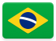
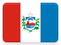
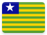
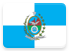
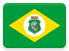
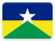

# Brazil 

*Olá velhx amigx, tudo bem?* This page contains institutional identity assets and visual history from **Brazil** .

## Records

| Image | Identity |
| :---: | :------- |

## Subordinate Collections

Subordinate records for Brazil are organized by state.

| Flag | Region | Flag | Region |
| :---: | :---: | :---: | :---: |
|  | Acre |  | Paraíba |
|  | Alagoas |  | Paraná |
|  | Amapá |  | Pernambuco |
|  | Amazonas |  | [Piauí](CA/QC.html) |
|  | Bahia |  | Rio de Janeiro |
|  | Ceará |  | Rio Grande do Norte |
|  | Distrito Federal |  | Rio Grande do Sul |
|  | Espírito Santo |  | Rondônia |
|  | Goiás |  | Roraima |
|  | Maranhão |  | Santa Catarina |
|  | Mato Grosso |  | São Paulo |
|  | Mato Grosso do Sul |  | Sergipe |
|  | Minas Gerais |  | Tocantins |
|  | Pará | | | |

## Navigation

[← Back to South America ](../SA.html)