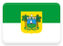

# Rio Grande do Norte 

This page contains institutional identity assets and visual history from the **Estado do Rio Grande do Norte** .

## Records

| Image | Identity | Years Active | Tags ([?](/guide/flags.html#Flags-Aiding-in-Classification)) |
| :---: | :------- | :-----------:| :---: |

## Subordinate Collections

Records internal to Rio Grande do Norte are organized by municipality (município), of which there are 167.

*NBN* has no records to display here yet. Bummer.

## Navigation

[← Back to Brazil ](../BR.html)

---

Page instantiated: 19 August 2019.
Date of last revision: 19 August 2019.